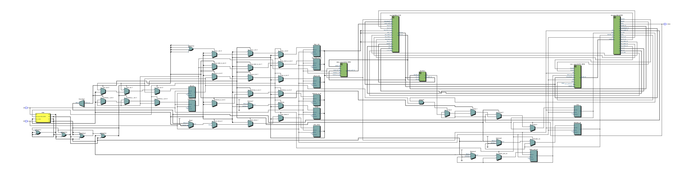

# Cirno Processing Unit

## Team Cirno

- Ziyang Li, A92070182
- Kai Li, A13962269
- Dingmei Gu, A14729954

## 1. Introduction

Our CPU architecture is called **Cirno**. We know that this CPU is designed for only the three programs assigned, and its ok for us to have very specific commands. But we still do want to write a general purpose CPU that has the potential to run other programs as well. So our philosophy is to still give as much space as possible towards generality. Meanwhile, there's also some specific instructions that we use a lot. So sometimes we will give priority to these instructions as well. We strived for generality, and as a consequence we made it. We can actually write very sophisticated programs outside of the three programs.

Up to this point we have actually implemented all of the Lab Projects. We will first start from introducing our ISA and our three-program assembly implementation, and then our Assembler and Simulator/Debugger, and finally our CPU design.

## 2. ISA

### 2.1. Overview

Our ISA, to maintain the generality of a general purpose CPU, we strive to make full use of every bit possible. We finally choose to have `4` general purpose registers, which means that we need `2` bits to represent the register index. There are certainly different kinds of instructions that use different amount of registers or immediates. Therefore we use variable length opcode. We classify our instruction to have 6 types:

1. Jump Immediate Instruction. We find the offset of Jump to be very important and therefore this instruction has the minimal opcode lengths. This set includes both `jump` and `branch`, and are both using immediate offsets.

2. Immediate Instructions. Often times we need registers to be operated with immediates. This includes `moving` immediates to registers, `and` immediate and also `shift` immediates.

3. Load/Store Instructions. Although its load and store, they have the same structure as the arithmatic instructions.

4. Binary Arithmatic Instructions. These instructions involve operations on two registers. They include `shift`, `move`, `add`, `sub`, `and`, `or`, and `xor`.

5. Unary Arithmatic Instructions. There's only a single `increment` instruction in this set. We include `increment` instruction because it is very useful in loops.

6. Jump Register Instructions. We also have two instructions for jumping or branching to an address stored in a register. These instructions are particularly important when we want to jump towards a very faraway instruction. Note that the address we store inside the register is absolute and we only have `8`-bit registers. Therefore we need to make our number of instructions per program always less than `256`.

7. Control Instructions. These instructions will not involve any data. There are `nil` and `halt` instructions for the CPU to send control signals.

### 2.2. Instruction List

Here we provide a complete instruction list of our ISA. Note that we divide the table cells to different sections in order to denote different component of each instruction. On the right most column we also specified what is the meaning of the actual instruction.

Few Side Notes about some of the variable names we use right here:

* `$pc`: Program Counter. Not necessarily `1` byte in size. Could have more bits.
* `$cmp`: Compare Register. Only have `1` bit. Could be written by `cmp` instruction, and will be used by `br` instruction.
* `mem`: The Main Memory, contains `256` bytes.

<table>
  <thead>
    <tr>
      <th>Function</th>
      <th>Code</th>
      <th>8</th>
      <th>7</th>
      <th>6</th>
      <th>5</th>
      <th>4</th>
      <th>3</th>
      <th>2</th>
      <th>1</th>
      <th>0</th>
      <th>Description</th>
    </tr>
  </thead>
  <tbody>
    <tr>
      <td>Jump Immediate</td>
      <td><code>jmpi</code></td>
      <td><code>1</code></td>
      <td><code>1</code></td>
      <td><code>1</code></td>
      <td colspan="6" align="center"><code>imm (signed)</code></td>
      <td><code>$pc = $pc + imm</code></td>
    </tr>
    <tr>
      <td>And Immediate</td>
      <td><code>andi</code></td>
      <td><code>1</code></td>
      <td><code>1</code></td>
      <td><code>0</code></td>
      <td colspan="2" align="center"><code>$a</code></td>
      <td colspan="4" align="center"><code>imm</code></td>
      <td><code>$a = $a & imm</code></td>
    </tr>
    <tr>
      <td>Move Immediate High</td>
      <td><code>movih</code></td>
      <td><code>1</code></td>
      <td><code>0</code></td>
      <td><code>1</code></td>
      <td colspan="2" align="center"><code>$a</code></td>
      <td colspan="4" align="center"><code>imm</code></td>
      <td><code>$a[4:7] = imm</code></td>
    </tr>
    <tr>
      <td>Move Immediate Low</td>
      <td><code>movil</code></td>
      <td><code>1</code></td>
      <td><code>0</code></td>
      <td><code>0</code></td>
      <td colspan="2" align="center"><code>$a</code></td>
      <td colspan="4" align="center"><code>imm</code></td>
      <td><code>$a[0:3] = imm</code></td>
    </tr>
    <tr>
      <td>Shift Right Immediate</td>
      <td><code>shri</code></td>
      <td><code>0</code></td>
      <td><code>1</code></td>
      <td><code>1</code></td>
      <td><code>1</code></td>
      <td colspan="2" align="center"><code>$a</code></td>
      <td colspan="3" align="center"><code>shamt</code></td>
      <td><code>$a = $a >> shamt</code></td>
    </tr>
    <tr>
      <td>Shift Left Immediate</td>
      <td><code>shli</code></td>
      <td><code>0</code></td>
      <td><code>1</code></td>
      <td><code>1</code></td>
      <td><code>0</code></td>
      <td colspan="2" align="center"><code>$a</code></td>
      <td colspan="3" align="center"><code>shamt</code></td>
      <td><code>$a = $a << shamt</code></td>
    </tr>
    <tr>
      <td>Branch if Equal Immediate</td>
      <td><code>beqi</code></td>
      <td><code>0</code></td>
      <td><code>1</code></td>
      <td><code>0</code></td>
      <td><code>1</code></td>
      <td><code>1</code></td>
      <td colspan="4" align="center"><code>imm (signed)</code></td>
      <td>
        <code>if cmp:</code><br />
        <code>&nbsp; $pc = $pc + imm</code></td>
    </tr>
    <tr>
      <td>Shift Register</td>
      <td><code>sh</code></td>
      <td><code>0</code></td>
      <td><code>1</code></td>
      <td><code>0</code></td>
      <td><code>1</code></td>
      <td><code>0</code></td>
      <td colspan="2" align="center"><code>$a</code></td>
      <td colspan="2" align="center"><code>$b</code></td>
      <td>
        <code>shamt = $b[2:0]</code><br />
        <code>if $b[3] == 1:</code><br />
        <code>&nbsp; $a = $a >> shamt</code><br />
        <code>else:</code><br />
        <code>&nbsp; $a = $a << shamt</code>
      </td>
    </tr>
    <tr>
      <td>Store</td>
      <td><code>st</code></td>
      <td><code>0</code></td>
      <td><code>1</code></td>
      <td><code>0</code></td>
      <td><code>0</code></td>
      <td><code>1</code></td>
      <td colspan="2" align="center"><code>$a</code></td>
      <td colspan="2" align="center"><code>$b</code></td>
      <td><code>mem[$b] = $a</code></td>
    </tr>
    <tr>
      <td>Load</td>
      <td><code>ld</code></td>
      <td><code>0</code></td>
      <td><code>1</code></td>
      <td><code>0</code></td>
      <td><code>0</code></td>
      <td><code>0</code></td>
      <td colspan="2" align="center"><code>$a</code></td>
      <td colspan="2" align="center"><code>$b</code></td>
      <td><code>$a = mem[$b]</code></td>
    </tr>
    <tr>
      <td>Move</td>
      <td><code>mov</code></td>
      <td><code>0</code></td>
      <td><code>0</code></td>
      <td><code>1</code></td>
      <td><code>1</code></td>
      <td><code>1</code></td>
      <td colspan="2" align="center"><code>$a</code></td>
      <td colspan="2" align="center"><code>$b</code></td>
      <td><code>$a = $b</code></td>
    </tr>
    <tr>
      <td>Compare</td>
      <td><code>cmp</code></td>
      <td><code>0</code></td>
      <td><code>0</code></td>
      <td><code>1</code></td>
      <td><code>1</code></td>
      <td><code>0</code></td>
      <td colspan="2" align="center"><code>$a</code></td>
      <td colspan="2" align="center"><code>$b</code></td>
      <td><code>$cmp = $a == $b</code></td>
    </tr>
    <tr>
      <td>Add</td>
      <td><code>add</code></td>
      <td><code>0</code></td>
      <td><code>0</code></td>
      <td><code>1</code></td>
      <td><code>0</code></td>
      <td><code>1</code></td>
      <td colspan="2" align="center"><code>$a</code></td>
      <td colspan="2" align="center"><code>$b</code></td>
      <td><code>$a = $a + $b</code></td>
    </tr>
    <tr>
      <td>Subtract</td>
      <td><code>sub</code></td>
      <td><code>0</code></td>
      <td><code>0</code></td>
      <td><code>1</code></td>
      <td><code>0</code></td>
      <td><code>0</code></td>
      <td colspan="2" align="center"><code>$a</code></td>
      <td colspan="2" align="center"><code>$b</code></td>
      <td><code>$a = $a - $b</code></td>
    </tr>
    <tr>
      <td>And</td>
      <td><code>and</code></td>
      <td><code>0</code></td>
      <td><code>0</code></td>
      <td><code>0</code></td>
      <td><code>1</code></td>
      <td><code>1</code></td>
      <td colspan="2" align="center"><code>$a</code></td>
      <td colspan="2" align="center"><code>$b</code></td>
      <td><code>$a = $a & $b</code></td>
    </tr>
    <tr>
      <td>Or</td>
      <td><code>or</code></td>
      <td><code>0</code></td>
      <td><code>0</code></td>
      <td><code>0</code></td>
      <td><code>1</code></td>
      <td><code>0</code></td>
      <td colspan="2" align="center"><code>$a</code></td>
      <td colspan="2" align="center"><code>$b</code></td>
      <td><code>$a = $a | $b</code></td>
    </tr>
    <tr>
      <td>Xor</td>
      <td><code>xor</code></td>
      <td><code>0</code></td>
      <td><code>0</code></td>
      <td><code>0</code></td>
      <td><code>0</code></td>
      <td><code>1</code></td>
      <td colspan="2" align="center"><code>$a</code></td>
      <td colspan="2" align="center"><code>$b</code></td>
      <td><code>$a = $a ^ $b</code></td>
    </tr>
    <tr>
      <td>Incr</td>
      <td><code>incr</code></td>
      <td><code>0</code></td>
      <td><code>0</code></td>
      <td><code>0</code></td>
      <td><code>0</code></td>
      <td><code>0</code></td>
      <td><code>1</code></td>
      <td><code>1</code></td>
      <td colspan="2" align="center"><code>$a</code></td>
      <td><code>$a++</code></td>
    </tr>
    <tr>
      <td>Jump Register</td>
      <td><code>jmp</code></td>
      <td><code>0</code></td>
      <td><code>0</code></td>
      <td><code>0</code></td>
      <td><code>0</code></td>
      <td><code>0</code></td>
      <td><code>1</code></td>
      <td><code>0</code></td>
      <td colspan="2" align="center"><code>$a</code></td>
      <td><code>$pc = $a</code></td>
    </tr>
    <tr>
      <td>Branch if Equal</td>
      <td><code>beq</code></td>
      <td><code>0</code></td>
      <td><code>0</code></td>
      <td><code>0</code></td>
      <td><code>0</code></td>
      <td><code>0</code></td>
      <td><code>0</code></td>
      <td><code>1</code></td>
      <td colspan="2" align="center"><code>$a</code></td>
      <td><code>if $cmp: $pc = $a</code></td>
    </tr>
    <tr>
      <td>Halt</td>
      <td><code>halt</code></td>
      <td><code>0</code></td>
      <td><code>0</code></td>
      <td><code>0</code></td>
      <td><code>0</code></td>
      <td><code>0</code></td>
      <td><code>0</code></td>
      <td><code>0</code></td>
      <td><code>0</code></td>
      <td><code>1</code></td>
      <td>CPU Stops Working</td>
    </tr>
    <tr>
      <td>No Op</td>
      <td><code>nil</code></td>
      <td><code>0</code></td>
      <td><code>0</code></td>
      <td><code>0</code></td>
      <td><code>0</code></td>
      <td><code>0</code></td>
      <td><code>0</code></td>
      <td><code>0</code></td>
      <td><code>0</code></td>
      <td><code>0</code></td>
      <td>Nothing Happens</td>
    </tr>
  </tbody>
</table>

### 2.3. Sugar Instructions

There are several "sugar instructions" for us to write better assembly code. These instructions are not internally supported by our CPU. But we will use our assembler to transcribe these instructions to one or more other instructions. We need to note that there's no native "label" support so we put all the "label" related instructions here.

| Function | Code | Format | Description |
|----------|------|--------|-------------|
| Move Label | `movl` | `movl $reg label` | Because a label usually represents an 8-bit number, this single instruction will be compiled into two instructions: first `movil` the lower part of the absolute position of `label` and then `movih` the upper part of the `label`. This could be used perfectly alone with `jmpr` since `jmpr` will jump to a position specified by the data in a register. |
| Move Immediate | `movi` | `movi $reg <8-bit-number>` | This will be just transcribed to `movil` and `movih` the two parts of this immediate |
| Clear | `clr` | `clr $reg` | This instruction will be transcribed to `addi $reg 0`, and will set `$reg` directly to `0` |
| Jump Label | `jmpl` | `jmpl $reg <label>` | You will be able to freely use the register `$reg` to use this command. This instruction will first move the label address to `$reg`, and then jump using that `$reg` |
| Branch if Eq Label | `beql` | `brl $reg <label>` | This is almost the same as `Jump Label`, instead it will check if `cmp` is `1` before jumping. If not, `$pc` will be just advanced by `1`. Again you will need to be able to use the `$reg` to use this instruction |
| Jump Immediate Label | `jmpil` | `jmpil <label>` | If you are very sure that the difference between the current instruction and the label is within 32, then you can use this instruction. This will directly jump to the `<label>` specified |
| Branch Immediate Label | `beqil` | `beqil <label>` | If you are very sure that the difference between the current instruction and the label is within 8, then you can use this instruction. This will branch to the `<label>` if `$cmp = 0` |

### 2.4. Internal Operands

There are several registers in our CPU:

| Register | Size | Usage |
|----------|------|-------|
| `$pc`    | `8`  | Program Counter |
| `$cmp`   | `1`  | The comparation result bit. Usually `1` if the the last comparation operands are equal |
| `$0`     | `8`  | General Purpose Register #0 |
| `$1`     | `8`  | General Purpose Register #1 |
| `$2`     | `8`  | General Purpose Register #2 |
| `$3`     | `8`  | General Purpose Register #3 |

### 2.5. Control Flow

#### What types of branches are supported?

We have `beq`, `beqi`, `jmp`, `jmpi`

- `beq` instruction provides the ability to branch when the previous comparison is true. In details, `beq $a` where $a is a general purpose register which stores the address of the targeting address for branching. `beq $a` will perform branching if the value stored in cmp register is true.

- `beqi` instruction provides the ability to branch when the previous comparison is true. In details, `beq imm(signed)` where imm is a signed direct value which is the delta between the current address and the address of the targeting address for branching. `beq imm` will perform branching if the value stored in cmp register is true.

- `jmp` instruction provides the ability to jump to an address, where the address is stored in a general purpose register.

- `jmpi` instruction provides the ability to jump to an address, where the address is a signed direct value which is the delta between the current address of the targeting address for branching.

#### How are the target addresses calculated?

For `beq` and `jmp` instructions, the target address is stored in a general purpose register which can be populated by `mov`, `sub` and other instruction which stores value into a general purpose register.

For `beqi` and `jmpi` instructions, the target address is a signed direct value without using a general purpose register, which can be loaded directly from assembly language.

#### What is the maximum branch distance supported?

The `beq` and `jmp` has the maximum ability for branching, where the address of branching is stored in a general purpose register. Since the maximum value supported in a register is `255`, the maximum branch distance our ISA supported is from `0` to `255`, although we are consciously limiting our instruction memory to within `256`.

### 2.6. Addressing Mode

#### 2.6.1. For Instruction Memory:

`beqi` and `jmpi` will use relative addressing mode. The reason that these two instructions are relative addressing mode is because the branching distance is directly stored as a direct signed value in assembly code.

`beq` and `jmp` will use the absolute instruction index stored in registers which considered direct addressing mode.

#### 2.6.2. For Data Memory:

We use direct addressing mode for data memory.

### 2.7. Machine Classification

We classify our machin to be a Load/Store machine.

### 2.8. Examples

An example program of our ISA is this:

``` asm
movil $0 1
jmpi 5
incr $0
incr $0
incr $0
incr $0
incr $0
halt
```

In this example we are first setting the `$0` register to `1`. And then we jump `5` instructions forward, which will get us to the last instruction. It will execute the last instruction and the ending value stored in `$0` will be only incremented by 1 time which is `2`, or `0b00000010`, as opposed to being incremented by 5 times.

We have a "sugared" version of this program which is more readable:

``` asm
  movil $0 1
  jmpil end
  incr $0
  incr $0
  incr $0
  incr $0
end:
  incr $0
  halt
```

Here we are using `jmpil` which is a "sugar instruction" jumping to a label called `end`. This program does exactly the same thing as the previous one.

After the assembler compilation, we will get machine code like this:

```
100000001
111000101
000001100
000001100
000001100
000001100
000001100
000000001
```

Obviously there are `8` instructions in the original example and hence we are getting `8` lines of machine code. Note that each line contains `9` bits, demonstrating our `9`-bit ISA design.

We are providing another example which involves more branching and looping like this:

``` asm
  movil $0 9        ; $0 = a = 9
  movil $1 4        ; $1 = b = 4
                    ; $2 = i = 0
                    ; $3 = product = 0
loop_start:         ; do {
  add $3 $0         ;   product += a
  incr $2           ;   i += 1
  cmp $1 $2         ;   cmp = b == i
  beqil loop_end    ; }
  jmpil loop_start  ; while (i < b);
loop_end:
  halt
```

In this example we implemented a multiply function. We will store the first operand in `$0`, the second in `$1`, and basically doing a loop and get the product in `$3`. We are using `$2` as the incrementor. Note how we are using (sugared) branching instructions. After compilation, we have

```
100001001
100010100
001011100
000001110
001100110
010110010
111100100
000000001
```

We also want to demonstrate how we are doing debugging labels. Our assembler can generate code like this to aid debugging. The above program will output something like this:

```
0: 100001001 movil $0 9
1: 100010100 movil $1 4
2: 001011100 add $3 $0 <- loop_start
3: 000001110 incr $2
4: 001100110 cmp $1 $2
5: 010110010 beqil loop_end
6: 111100100 jmpil loop_start
7: 000000001 halt <- loop_end
```

Here we have instruction indices, the machine code generated as well as the original assembly instruction printed. We also included the label. This will largely aid our debugging process, and we will be using this format to demonstrate our three program implementations in the next section.

## 3. Program Implementations

In this section we present our program implementations for the three assigned programs. The process we come up with this is actually first writing through the C code, and then translate the C code to our assembly format. In terms of logistics we have `139` instructions for the first program, `185` instructions for the second program, and `232` instructions for the last program.

<!-- Substitution Code: (\d+): (\d+)(\s(\w+(\s+[\w\$\d]+)?)(,?\s+[\$\w]+)?)?(\s<\-\s(\w+))?, Change to | $1 | $2 | $3 | $8 | -->

### 3.1. Program 1: Hamming Encoder

|  | Byte Code | Assembly | Label |
|--|-----------|----------|-------|
|   0 | 101010001 |  movi	$1, 30 | setup |
|   1 | 100011110 |  |  |
|   2 | 101001111 |  movi	$0, 253 |  |
|   3 | 100001101 |  |  |
|   4 | 010010100 |  st	$1, $0 |  |
|   5 | 110010000 |  clr	$1 |  |
|   6 | 010001001 |  ld	$2 $1 | while_start |
|   7 | 100001010 |  movil	$0 10 |  |
|   8 | 010011000 |  st	$2 $0 |  |
|   9 | 000001101 |  incr $1 |  |
|  10 | 010001101 |  ld	$3 $1 |  |
|  11 | 000001101 |  incr	$1 |  |
|  12 | 100001111 |  movil	$0 15 |  |
|  13 | 010010100 |  st	$1 $0 |  |
|  14 | 011011100 |  shli	$3 4 |  |
|  15 | 011110100 |  shri	$2 4 |  |
|  16 | 000101110 |  or	$3 $2 |  |
|  17 | 100001011 |  movil $0 11 |  |
|  18 | 010011100 |  st	$3 $0 |  |
|  19 | 001111011 |  mov	$2 $3 |  |
|  20 | 011110001 |  shri	$2 1 |  |
|  21 | 110010000 |  clr	$1 |  |
|  22 | 101000000 |  movi	$0 7 |  |
|  23 | 100000111 |  |  |
|  24 | 000011110 |  xor	$3 $2 | p8_while_start |
|  25 | 011110001 |  shri	$2 1 |  |
|  26 | 000001101 |  incr	$1 |  |
|  27 | 001100100 |  cmp	$1 $0 |  |
|  28 | 010110010 |  beqil p8_while_end |  |
|  29 | 111100101 |  jmpil	p8_while_start |  |
|  30 | 011011100 |  shli	$3 4 | p8_while_end |
|  31 | 101001111 |  movi	$0 250 |  |
|  32 | 100001010 |  |  |
|  33 | 010001000 |  ld	$2 $0 |  |
|  34 | 110101110 |  andi $2 14 |  |
|  35 | 000101110 |  or $3 $2 |  |
|  36 | 100001100 |  movil	$0 12 |  |
|  37 | 010011100 |  st	$3 $0 |  |
|  38 | 100001011 |  movil	$0 11 |  |
|  39 | 010001100 |  ld	$3 $0 |  |
|  40 | 100001000 |  movil	$0 8 |  |
|  41 | 000111100 |  and	$3 $0 |  |
|  42 | 100001010 |  movil	$0 10 |  |
|  43 | 010001000 |  ld	$2 $0 |  |
|  44 | 011110001 |  shri	$2 1 |  |
|  45 | 110100111 |  andi	$2 7 |  |
|  46 | 000101110 |  or	$3 $2 |  |
|  47 | 001111011 |  mov $2 $3 |  |
|  48 | 011110001 |  shri	$2 1 |  |
|  49 | 110010000 |  clr	$1 |  |
|  50 | 101000000 |  movi	$0 7 |  |
|  51 | 100000111 |  |  |
|  52 | 000011110 |  xor	$3 $2 | p4_while_start |
|  53 | 011110001 |  shri	$2 1 |  |
|  54 | 000001101 |  incr	$1 |  |
|  55 | 001100100 |  cmp	$1 $0 |  |
|  56 | 010110010 |  beqil p4_while_end |  |
|  57 | 111100101 |  jmpil	p4_while_start |  |
|  58 | 110110001 |  andi $3 1 | p4_while_end |
|  59 | 101001111 |  movi $0 252 |  |
|  60 | 100001100 |  |  |
|  61 | 010001000 |  ld $2 $0 |  |
|  62 | 000101011 |  or $2 $3 |  |
|  63 | 011010001 |  shli $2 1 |  |
|  64 | 100001010 |  movil $0 10 |  |
|  65 | 010001100 |  ld $3 $0 |  |
|  66 | 110110001 |  andi $3 1 |  |
|  67 | 000101011 |  or $2 $3 |  |
|  68 | 011010001 |  shli $2 1 |  |
|  69 | 100001100 |  movil $0 12 |  |
|  70 | 010011000 |  st $2 $0 |  |
|  71 | 100001011 |  movil	$0 11 |  |
|  72 | 010001100 |  ld	$3 $0 |  |
|  73 | 011111001 |  shri $3 1 |  |
|  74 | 001111011 |  mov $2 $3 |  |
|  75 | 011110001 |  shri	$2 1 |  |
|  76 | 000011110 |  xor	$3 $2 |  |
|  77 | 011110011 |  shri	$2 3 |  |
|  78 | 000011110 |  xor	$3 $2 |  |
|  79 | 011110001 |  shri $2 1 |  |
|  80 | 000011110 |  xor $3 $2 |  |
|  81 | 100001010 |  movil	$0 10 |  |
|  82 | 010001000 |  ld	$2 $0 |  |
|  83 | 000011110 |  xor	$3 $2 |  |
|  84 | 011110010 |  shri	$2 2 |  |
|  85 | 000011110 |  xor	$3 $2 |  |
|  86 | 011110001 |  shri $2 1 |  |
|  87 | 000011110 |  xor $3 $2 |  |
|  88 | 110110001 |  andi	$3 1 |  |
|  89 | 100001100 |  movil $0 12 |  |
|  90 | 010001000 |  ld $2 $0 |  |
|  91 | 000101011 |  or $2 $3 |  |
|  92 | 011010001 |  shli $2 1 |  |
|  93 | 010011000 |  st	$2 $0 |  |
|  94 | 100001011 |  movil	$0 11 |  |
|  95 | 010001100 |  ld	$3 $0 |  |
|  96 | 001111011 |  mov $2 $3 |  |
|  97 | 011110010 |  shri	$2 2 |  |
|  98 | 110010000 |  clr	$1 |  |
|  99 | 101000000 |  movi	$0 3 |  |
| 100 | 100000011 |  |  |
| 101 | 000011110 |  xor	$3 $2 | p1_while_start |
| 102 | 011110010 |  shri	$2 2 |  |
| 103 | 000001101 |  incr	$1 |  |
| 104 | 001100100 |  cmp	$1 $0 |  |
| 105 | 010110010 |  beqil p1_while_end |  |
| 106 | 111100101 |  jmpil	p1_while_start |  |
| 107 | 101001111 |  movi	$0 250 | p1_while_end |
| 108 | 100001010 |  |  |
| 109 | 010001000 |  ld	$2 $0 |  |
| 110 | 000011110 |  xor $3 $2 |  |
| 111 | 011110001 |  shri	$2 1 |  |
| 112 | 000011110 |  xor	$3 $2 |  |
| 113 | 011110010 |  shri	$2 2 |  |
| 114 | 000011110 |  xor	$3 $2 |  |
| 115 | 110110001 |  andi	$3 1 |  |
| 116 | 100001100 |  movil	$0 12 |  |
| 117 | 010001000 |  ld	$2 $0 |  |
| 118 | 000101011 |  or	$2 $3 |  |
| 119 | 100001101 |  movil	$0 13 |  |
| 120 | 010000100 |  ld	$1 $0 |  |
| 121 | 010011001 |  st $2 $1 |  |
| 122 | 000001101 |  incr	$1 |  |
| 123 | 100001011 |  movil	$0 11 |  |
| 124 | 010001100 |  ld	$3 $0 |  |
| 125 | 010011101 |  st	$3 $1 |  |
| 126 | 000001101 |  incr	$1 |  |
| 127 | 100001101 |  movil	$0 13 |  |
| 128 | 010010100 |  st	$1 $0 |  |
| 129 | 100001111 |  movil	$0 15 |  |
| 130 | 010000100 |  ld $1 $0 |  |
| 131 | 101100001 |  movi	$2 30 |  |
| 132 | 100101110 |  |  |
| 133 | 001100110 |  cmp $1 $2 |  |
| 134 | 010110100 |  beqil while_end |  |
| 135 | 101110000 |  jmpl $3 while_start |  |
| 136 | 100110110 |  |  |
| 137 | 000001011 |  |  |
| 138 | 000000001 |  halt | while_end |

### 3.2. Program 2: Hamming Decoder

|  | Byte Code | Assembly | Label |
|--|-----------|----------|-------|
  | 0 | 101000101 |  movi $0 94 | setup |
  | 1 | 100001110 |  |  |
  | 2 | 101011111 |  movi $1 251 |  |
  | 3 | 100011011 |  |  |
  | 4 | 010010001 |  st $0 $1 |  |
  | 5 | 101000100 |  movi $0 64 |  |
  | 6 | 100000000 |  |  |
  | 7 | 010001000 |  ld $2 $0 | loop_start |
  | 8 | 000001100 |  incr $0 |  |
  | 9 | 010001100 |  ld $3 $0 |  |
 | 10 | 000001100 |  incr $0 |  |
 | 11 | 101011111 |  movi $1 255 |  |
 | 12 | 100011111 |  |  |
 | 13 | 010010001 |  st $0 $1 |  |
 | 14 | 100011110 |  movil $1 14 |  |
 | 15 | 010011001 |  st $2 $1 |  |
 | 16 | 100011101 |  movil $1 13 |  |
 | 17 | 010011101 |  st $3 $1 |  |
 | 18 | 011110111 |  shri $2 7 |  |
 | 19 | 110010000 |  clr $1 |  |
 | 20 | 101000000 |  movi $0 7 |  |
 | 21 | 100000111 |  |  |
 | 22 | 000011011 |  xor $2 $3 | p8_while_start |
 | 23 | 011111001 |  shri $3 1 |  |
 | 24 | 000001101 |  incr $1 |  |
 | 25 | 001100001 |  cmp $0 $1 |  |
 | 26 | 010110010 |  beqil p8_while_end |  |
 | 27 | 111100101 |  jmpil p8_while_start |  |
 | 28 | 110100001 |  andi $2 1 | p8_while_end |
 | 29 | 011010001 |  shli $2 1 |  |
 | 30 | 101001111 |  movi $0 252 |  |
 | 31 | 100001100 |  |  |
 | 32 | 010011000 |  st $2 $0 |  |
 | 33 | 100001101 |  movil $0 13 |  |
 | 34 | 010001100 |  ld $3 $0 |  |
 | 35 | 100001000 |  movil $0 8 |  |
 | 36 | 000111100 |  and $3 $0 |  |
 | 37 | 100001110 |  movil $0 14 |  |
 | 38 | 010001000 |  ld $2 $0 |  |
 | 39 | 011110100 |  shri $2 4 |  |
 | 40 | 110100111 |  andi $2 7 |  |
 | 41 | 000101110 |  or $3 $2 |  |
 | 42 | 010001000 |  ld $2 $0 |  |
 | 43 | 011110011 |  shri $2 3 |  |
 | 44 | 110010000 |  clr $1 |  |
 | 45 | 101000000 |  movi $0 7 |  |
 | 46 | 100000111 |  |  |
 | 47 | 000011011 |  xor $2 $3 | p4_while_start |
 | 48 | 011111001 |  shri $3 1 |  |
 | 49 | 000001101 |  incr $1 |  |
 | 50 | 001100001 |  cmp $0 $1 |  |
 | 51 | 010110010 |  beqil p4_while_end |  |
 | 52 | 111100101 |  jmpil p4_while_start |  |
 | 53 | 110100001 |  andi $2 1 | p4_while_end |
 | 54 | 101001111 |  movi $0 252 |  |
 | 55 | 100001100 |  |  |
 | 56 | 010000100 |  ld $1 $0 |  |
 | 57 | 000100110 |  or $1 $2 |  |
 | 58 | 011001001 |  shli $1 1 |  |
 | 59 | 100001110 |  movil $0 14 |  |
 | 60 | 010001000 |  ld $2 $0 |  |
 | 61 | 011110001 |  shri $2 1 |  |
 | 62 | 001111110 |  mov $3 $2 |  |
 | 63 | 011111001 |  shri $3 1 |  |
 | 64 | 000011011 |  xor $2 $3 |  |
 | 65 | 011111011 |  shri $3 3 |  |
 | 66 | 000011011 |  xor $2 $3 |  |
 | 67 | 011111001 |  shri $3 1 |  |
 | 68 | 000011011 |  xor $2 $3 |  |
 | 69 | 100001101 |  movil $0 13 |  |
 | 70 | 010001100 |  ld $3 $0 |  |
 | 71 | 011111001 |  shri $3 1 |  |
 | 72 | 000011011 |  xor $2 $3 |  |
 | 73 | 011111001 |  shri $3 1 |  |
 | 74 | 000011011 |  xor $2 $3 |  |
 | 75 | 011111011 |  shri $3 3 |  |
 | 76 | 000011011 |  xor $2 $3 |  |
 | 77 | 011111001 |  shri $3 1 |  |
 | 78 | 000011011 |  xor $2 $3 |  |
 | 79 | 110100001 |  andi $2 1 |  |
 | 80 | 000100110 |  or $1 $2 |  |
 | 81 | 011001001 |  shli $1 1 |  |
 | 82 | 100001100 |  movil $0 12 |  |
 | 83 | 010010100 |  st $1 $0 |  |
 | 84 | 110010000 |  clr $1 |  |
 | 85 | 100001110 |  movil $0 14 |  |
 | 86 | 010001000 |  ld $2 $0 |  |
 | 87 | 001111110 |  mov $3 $2 |  |
 | 88 | 011111010 |  shri $3 2 |  |
 | 89 | 101000000 |  movi $0 3 |  |
 | 90 | 100000011 |  |  |
 | 91 | 000011011 |  xor $2 $3 | p1_while1_start |
 | 92 | 011111010 |  shri $3 2 |  |
 | 93 | 000001101 |  incr $1 |  |
 | 94 | 001100001 |  cmp $0 $1 |  |
 | 95 | 010110010 |  beqil p1_while1_end |  |
 | 96 | 111100101 |  jmpil p1_while1_start |  |
 | 97 | 101001111 |  movi $0 253 | p1_while1_end |
 | 98 | 100001101 |  |  |
 | 99 | 010001100 |  ld $3 $0 |  |
| 100 | 110010000 |  clr $1 |  |
| 101 | 101000000 |  movi $0 4 |  |
| 102 | 100000100 |  |  |
| 103 | 000011011 |  xor $2 $3 | p1_while2_start |
| 104 | 011111010 |  shri $3 2 |  |
| 105 | 000001101 |  incr $1 |  |
| 106 | 001100001 |  cmp $0 $1 |  |
| 107 | 010110010 |  beqil p1_while2_end |  |
| 108 | 111100101 |  jmpil p1_while2_start |  |
| 109 | 110100001 |  andi $2 1 | p1_while2_end |
| 110 | 101001111 |  movi $0 252 |  |
| 111 | 100001100 |  |  |
| 112 | 010000100 |  ld $1 $0 |  |
| 113 | 000100110 |  or $1 $2 |  |
| 114 | 110000000 |  clr $0 |  |
| 115 | 110110000 |  clr $3 |  |
| 116 | 001111001 |  mov $2 $1 |  |
| 117 | 001110001 |  mov $0 $1 |  |
| 118 | 011100001 |  shri $0 1 |  |
| 119 | 000101000 |  or $2 $0 |  |
| 120 | 011100001 |  shri $0 1 |  |
| 121 | 000101000 |  or $2 $0 |  |
| 122 | 011100001 |  shri $0 1 |  |
| 123 | 000111000 |  and $2 $0 |  |
| 124 | 110100001 |  andi $2 1 |  |
| 125 | 000001111 |  incr $3 |  |
| 126 | 001101011 |  cmp $2 $3 |  |
| 127 | 010110010 |  beqil correct_parity_upper |  |
| 128 | 111001010 |  jmpil check_correct_parity_lower |  |
| 129 | 100001001 |  movil $0 9 | correct_parity_upper |
| 130 | 001000100 |  sub $1 $0 |  |
| 131 | 010101101 |  sh $3 $1 |  |
| 132 | 101001111 |  movi $0 253 |  |
| 133 | 100001101 |  |  |
| 134 | 010001000 |  ld $2 $0 |  |
| 135 | 000011011 |  xor $2 $3 |  |
| 136 | 010011000 |  st $2 $0 |  |
| 137 | 111001110 |  jmpil correct_parity_end |  |
| 138 | 110000000 |  clr $0 | check_correct_parity_lower |
| 139 | 001100100 |  cmp $1 $0 |  |
| 140 | 010110010 |  beqil to_end |  |
| 141 | 111000010 |  jmpil correct_parity_lower |  |
| 142 | 111001001 |  jmpil correct_parity_end | to_end |
| 143 | 000001100 |  incr $0 | correct_parity_lower |
| 144 | 001000100 |  sub $1 $0 |  |
| 145 | 010100001 |  sh $0 $1 |  |
| 146 | 101011111 |  movi $1 254 |  |
| 147 | 100011110 |  |  |
| 148 | 010001001 |  ld $2 $1 |  |
| 149 | 000011000 |  xor $2 $0 |  |
| 150 | 010011001 |  st $2 $1 |  |
| 151 | 101111111 |  movi $3 251 | correct_parity_end |
| 152 | 100111011 |  |  |
| 153 | 010000011 |  ld $0 $3 |  |
| 154 | 100111101 |  movil $3 13 |  |
| 155 | 010000111 |  ld $1 $3 |  |
| 156 | 011001100 |  shli $1 4 |  |
| 157 | 100111110 |  movil $3 14 |  |
| 158 | 010001011 |  ld $2 $3 |  |
| 159 | 011110010 |  shri $2 2 |  |
| 160 | 110100001 |  andi $2 1 |  |
| 161 | 000100110 |  or $1 $2 |  |
| 162 | 010001011 |  ld $2 $3 |  |
| 163 | 011110011 |  shri $2 3 |  |
| 164 | 110101110 |  andi $2 14 |  |
| 165 | 000100110 |  or $1 $2 |  |
| 166 | 010010100 |  st $1 $0 |  |
| 167 | 000001100 |  incr $0 |  |
| 168 | 100111101 |  movil $3 13 |  |
| 169 | 010000111 |  ld $1 $3 |  |
| 170 | 011101100 |  shri $1 4 |  |
| 171 | 010010100 |  st $1 $0 |  |
| 172 | 000001100 |  incr $0 |  |
| 173 | 100111011 |  movil $3 11 |  |
| 174 | 010010011 |  st $0 $3 |  |
| 175 | 100111111 |  movil $3 15 |  |
| 176 | 010000011 |  ld $0 $3 |  |
| 177 | 101110101 |  movi $3 94 |  |
| 178 | 100111110 |  |  |
| 179 | 001100011 |  cmp $0 $3 |  |
| 180 | 010110100 |  beqil loop_end |  |
| 181 | 101010000 |  jmpl $1 loop_start |  |
| 182 | 100010111 |  |  |
| 183 | 000001001 |  |  |
| 184 | 000000001 |  halt | loop_end |

### 3.3. Program 3: Pattern Finder

|  | Byte Code | Assembly | Label |
|--|-----------|----------|-------|
  | 0 | 110010000 |  andi	$1 0 |  |
  | 1 | 101101100 |  movi	$2 193 |  |
  | 2 | 100100001 |  |  |
  | 3 | 010010110 |  sb	$1 $2 |  |
  | 4 | 101101100 |  movi	$2 194 |  |
  | 5 | 100100010 |  |  |
  | 6 | 010010110 |  sb	$1 $2 |  |
  | 7 | 101101100 |  movi $2 192 |  |
  | 8 | 100100000 |  |  |
  | 9 | 010010110 |  sb  $1 $2 |  |
 | 10 | 101101100 |  movi	$2 195 |  |
 | 11 | 100100011 |  |  |
 | 12 | 101010001 |  movi	$1 31 |  |
 | 13 | 100011111 |  |  |
 | 14 | 010010110 |  sb	$1 $2 |  |
 | 15 | 101001100 |  movi	$0 197 |  |
 | 16 | 100000101 |  |  |
 | 17 | 101011000 |  movi	$1 128 |  |
 | 18 | 100010000 |  |  |
 | 19 | 010010100 |  sb	$1 $0 |  |
 | 20 | 101111000 |  movi	$3 128 |  |
 | 21 | 100110000 |  |  |
 | 22 | 010000111 |  lb	$1 $3 |  |
 | 23 | 101101100 |  movi	$2 198 |  |
 | 24 | 100100110 |  |  |
 | 25 | 010010110 |  sb	$1 $2 |  |
 | 26 | 101101100 |  movi	$2 195 | outer_while |
 | 27 | 100100011 |  |  |
 | 28 | 010000110 |  lb 	$1 $2 |  |
 | 29 | 101001001 |  movl	$0 end_outer_while |  |
 | 30 | 100001110 |  |  |
 | 31 | 110110000 |  andi	$3 0 |  |
 | 32 | 001100111 |  cmp	$1 $3 |  |
 | 33 | 000000100 |  beq	$0 |  |
 | 34 | 101110000 |  movi	$3 1 |  |
 | 35 | 100110001 |  |  |
 | 36 | 001000111 |  sub	$1 $3 |  |
 | 37 | 010010110 |  sb	$1 $2 |  |
 | 38 | 101101100 |  movi	$2 197 |  |
 | 39 | 100100101 |  |  |
 | 40 | 010000110 |  lb	$1 $2 |  |
 | 41 | 101110000 |  movi	$3 1 |  |
 | 42 | 100110001 |  |  |
 | 43 | 001010111 |  add	$1 $3 |  |
 | 44 | 010010110 |  sb	$1 $2 |  |
 | 45 | 101011000 |  movi	$1 128 |  |
 | 46 | 100010000 |  |  |
 | 47 | 010000101 |  lb	$1 $1 |  |
 | 48 | 101101100 |  movi	$2 199 |  |
 | 49 | 100100111 |  |  |
 | 50 | 010010110 |  sb	$1 $2 |  |
 | 51 | 110010000 |  andi	$1 0 |  |
 | 52 | 101101100 |  movi	$2 200 |  |
 | 53 | 100101000 |  |  |
 | 54 | 010010110 |  sb	$1 $2 |  |
 | 55 | 101010000 |  movi	$1 8 |  |
 | 56 | 100011000 |  |  |
 | 57 | 101101100 |  movi	$2 196 |  |
 | 58 | 100100100 |  |  |
 | 59 | 010010110 |  sb	$1 $2 |  |
 | 60 | 101101100 |  movi	$2 196 | inner_while |
 | 61 | 100100100 |  |  |
 | 62 | 010000110 |  lb	$1 $2 |  |
 | 63 | 101001001 |  movl	$0 end_inner_while |  |
 | 64 | 100000011 |  |  |
 | 65 | 110110000 |  andi	$3 0 |  |
 | 66 | 001100111 |  cmp	$1 $3 |  |
 | 67 | 000000100 |  beq	$0 |  |
 | 68 | 101110000 |  movi	$3 1 |  |
 | 69 | 100110001 |  |  |
 | 70 | 001000111 |  sub	$1 $3 |  |
 | 71 | 010010110 |  sb	$1 $2 |  |
 | 72 | 101101100 |  movi	$2 198 |  |
 | 73 | 100100110 |  |  |
 | 74 | 010000110 |  lb	$1 $2 |  |
 | 75 | 101101010 |  movi	$2 160 |  |
 | 76 | 100100000 |  |  |
 | 77 | 010001110 |  lb	$3 $2 |  |
 | 78 | 011011100 |  shli $3 4 |  |
 | 79 | 000010111 |  xor	$1 $3 |  |
 | 80 | 101101111 |  movi	$2 240 |  |
 | 81 | 100100000 |  |  |
 | 82 | 000110110 |  and 	$1 $2 |  |
 | 83 | 101000110 |  movl	$0 ifmatch |  |
 | 84 | 100001000 |  |  |
 | 85 | 110110000 |  andi	$3 0 |  |
 | 86 | 001100111 |  cmp	$1 $3 |  |
 | 87 | 000000100 |  beq	$0 |  |
 | 88 | 101101100 |  movi	$2 198 | not_match |
 | 89 | 100100110 |  |  |
 | 90 | 010000110 |  lb	$1 $2 |  |
 | 91 | 011001001 |  shli	$1 1 |  |
 | 92 | 101001100 |  movi	$0 199 |  |
 | 93 | 100000111 |  |  |
 | 94 | 010001100 |  lb	$3 $0 |  |
 | 95 | 011111111 |  shri	$3 7 |  |
 | 96 | 000100111 |  or 	$1 $3 |  |
 | 97 | 010010110 |  sb	$1 $2 |  |
 | 98 | 010001100 |  lb	$3 $0 |  |
 | 99 | 011011001 |  shli	$3 1 |  |
| 100 | 010011100 |  sb	$3 $0 |  |
| 101 | 101000011 |  movl	$0 inner_while |  |
| 102 | 100001100 |  |  |
| 103 | 000001000 |  jmp	$0 |  |
| 104 | 101101100 |  movi	$2 193 | ifmatch |
| 105 | 100100001 |  |  |
| 106 | 010000110 |  lb	$1 $2 |  |
| 107 | 101110000 |  movi	$3 1 |  |
| 108 | 100110001 |  |  |
| 109 | 001010111 |  add	$1 $3 |  |
| 110 | 010010110 |  sb	$1 $2 |  |
| 111 | 101101100 |  movi	$2 196 |  |
| 112 | 100100100 |  |  |
| 113 | 010000110 |  lb	$1 $2 |  |
| 114 | 101100000 |  movi      $2 4 |  |
| 115 | 100100100 |  |  |
| 116 | 000110110 |  and	$1 $2 |  |
| 117 | 000010110 |  xor	$1 $2 |  |
| 118 | 101001000 |  movl	$0 ifinbyte |  |
| 119 | 100000110 |  |  |
| 120 | 110110000 |  andi	$3 0 |  |
| 121 | 001100111 |  cmp	$1 $3 |  |
| 122 | 000000100 |  beq	$0 |  |
| 123 | 101101100 |  movi	$2 196 |  |
| 124 | 100100100 |  |  |
| 125 | 010000110 |  lb	$1 $2 |  |
| 126 | 101100000 |  movi	$2 3 |  |
| 127 | 100100011 |  |  |
| 128 | 000010110 |  xor	$1 $2 |  |
| 129 | 001100111 |  cmp	$1 $3 |  |
| 130 | 000000100 |  beq	$0 |  |
| 131 | 101000101 |  movl	$0 not_match |  |
| 132 | 100001000 |  |  |
| 133 | 000001000 |  jmp	$0 |  |
| 134 | 101101100 |  movi	$2 200 | ifinbyte |
| 135 | 100101000 |  |  |
| 136 | 101010000 |  movi	$1 1 |  |
| 137 | 100010001 |  |  |
| 138 | 010010110 |  sb	$1 $2 |  |
| 139 | 101101100 |  movi	$2 192 |  |
| 140 | 100100000 |  |  |
| 141 | 010000110 |  lb  	$1 $2 |  |
| 142 | 000001101 |  incr 	$1 |  |
| 143 | 010010110 |  sb  	$1 $2 |  |
| 144 | 101000101 |  movl	$0 not_match |  |
| 145 | 100001000 |  |  |
| 146 | 000001000 |  jmp	$0 |  |
| 147 | 101101100 |  movi	$2 194 | end_inner_while |
| 148 | 100100010 |  |  |
| 149 | 010000110 |  lb	$1 $2 |  |
| 150 | 101001100 |  movi	$0 200 |  |
| 151 | 100001000 |  |  |
| 152 | 010001100 |  lb	$3 $0 |  |
| 153 | 001010111 |  add	$1 $3 |  |
| 154 | 010010110 |  sb	$1 $2 |  |
| 155 | 101000001 |  movl	$0 outer_while |  |
| 156 | 100001010 |  |  |
| 157 | 000001000 |  jmp	$0 |  |
| 158 | 110010000 |  andi	$1 0 | end_outer_while |
| 159 | 101101100 |  movi	$2 200 |  |
| 160 | 100101000 |  |  |
| 161 | 010010110 |  sb	$1 $2 |  |
| 162 | 101010000 |  movi	$1 5 |  |
| 163 | 100010101 |  |  |
| 164 | 101101100 |  movi	$2 196 |  |
| 165 | 100100100 |  |  |
| 166 | 010010110 |  sb	$1 $2 |  |
| 167 | 101001101 |  movl	$0 end_prog | last_byte_while |
| 168 | 100001111 |  |  |
| 169 | 110110000 |  andi	$3 0 |  |
| 170 | 001100111 |  cmp	$1 $3 |  |
| 171 | 000000100 |  beq	$0 |  |
| 172 | 101101100 |  movi	$2 198 |  |
| 173 | 100100110 |  |  |
| 174 | 010000110 |  lb	$1 $2 |  |
| 175 | 101101010 |  movi	$2 160 |  |
| 176 | 100100000 |  |  |
| 177 | 010001110 |  lb	$3 $2 |  |
| 178 | 011011100 |  shli	$3 4 |  |
| 179 | 000010111 |  xor	$1 $3 |  |
| 180 | 101101111 |  movi	$2 240 |  |
| 181 | 100100000 |  |  |
| 182 | 000110110 |  and 	$1 $2 |  |
| 183 | 101001100 |  movl	$0 last_byte_match |  |
| 184 | 100001011 |  |  |
| 185 | 110110000 |  andi	$3 0 |  |
| 186 | 001100111 |  cmp	$1 $3 |  |
| 187 | 000000100 |  beq	$0 |  |
| 188 | 101101100 |  movi	$2 198 | last_byte_not_match |
| 189 | 100100110 |  |  |
| 190 | 010000110 |  lb	$1 $2 |  |
| 191 | 011001001 |  shli	$1 1 |  |
| 192 | 010010110 |  sb	$1 $2 |  |
| 193 | 101101100 |  movi	$2 196 |  |
| 194 | 100100100 |  |  |
| 195 | 010000110 |  lb	$1 $2 |  |
| 196 | 101110000 |  movi	$3 1 |  |
| 197 | 100110001 |  |  |
| 198 | 001000111 |  sub	$1 $3 |  |
| 199 | 010010110 |  sb	$1 $2 |  |
| 200 | 101001010 |  movl	$0 last_byte_while |  |
| 201 | 100000111 |  |  |
| 202 | 000001000 |  jmp	$0 |  |
| 203 | 101101100 |  movi	$2 193 | last_byte_match |
| 204 | 100100001 |  |  |
| 205 | 010000110 |  lb	$1 $2 |  |
| 206 | 101110000 |  movi	$3 1 |  |
| 207 | 100110001 |  |  |
| 208 | 001010111 |  add	$1 $3 |  |
| 209 | 010010110 |  sb	$1 $2 |  |
| 210 | 101101100 |  movi	$2 200 |  |
| 211 | 100101000 |  |  |
| 212 | 101010000 |  movi	$1 1 |  |
| 213 | 100010001 |  |  |
| 214 | 010010110 |  sb	$1 $2 |  |
| 215 | 101101100 |  movi	$2 192 |  |
| 216 | 100100000 |  |  |
| 217 | 010000110 |  lb  	$1 $2 |  |
| 218 | 000001101 |  incr 	$1 |  |
| 219 | 010010110 |  sb  	$1 $2 |  |
| 220 | 101001011 |  movl	$0 last_byte_not_match |  |
| 221 | 100001100 |  |  |
| 222 | 000001000 |  jmp	$0 |  |
| 223 | 101101100 |  movi	$2 194 | end_prog |
| 224 | 100100010 |  |  |
| 225 | 010000110 |  lb	$1 $2 |  |
| 226 | 101001100 |  movi	$0 200 |  |
| 227 | 100001000 |  |  |
| 228 | 010001100 |  lb	$3 $0 |  |
| 229 | 001010111 |  add	$1 $3 |  |
| 230 | 010010110 |  sb	$1 $2 |  |
| 231 | 000000001 |  halt |  |

## 4. Assembler, Simulator and Debugger

After we implemented the three programs using our ISA, we start to implement the Assembler, Simulator and Debugger to test their effectiveness. In this section we are going to talk about their functionalities and usages.

### 4.1. Assembler

We implemented our Assembler using Python, mainly because python makes us very easy to deal with file inputs and outputs. It is our assembler which enables us to write nice looking assembly codes, run it and test it effectively.

#### 4.1.1. Assembler Usage

It's as simple as

```
$ python3 assemble.py test/add.s
```

This will print out the following result

```
101000101
100000101
100010011
001010000
```

#### 4.1.2. Exporting Simulator Runnable File

```
$ python3 assemble.py test/add.s > ../simulator/test/add.mem
```

Then give this `add.txt` to simulator and it will be able to directly run the file

#### 4.1.3. Print Debugging Symbols

When doing assembly, add a flag `--debug` to enable debugging. Like this:

```
$ python3 assemble.py test/mult.s --debug
```

This will print out something like this, as also demonstrated above:

```
0: 100001001 movil $0 9
1: 100010100 movil $1 4
2: 001011100 add $3 $0 <- loop_start
3: 000001110 incr $2
4: 001100110 cmp $1 $2
5: 010110010 beqil loop_end
6: 111100100 jmpil loop_start
7: 000000001 halt <- loop_end
```

#### 4.1.4. Assembly Language Syntax

It's very simple, we don't have any symbols. For each instruction specified on the design document, you simply add space between the different components. All the instruction will start with a **code**, like `jmpi`, `add`, `xor` and so on. After that it needs to be followed by either register id or immediate numbers.

If you want to specify the registers, you can only use `$0`, `$1`, `$2`, and `$3` since there are only 4 registers in our CPU.

When you want to specify the immediate, usually you only need positive number. There's one case in the `jmpi` instruction you can actually add a `minus` sign before the number to indicate that you want to jump backward.

### 4.2. Simulator and Debugger

#### 4.2.1. Basic Usages

We have written a simulator and a debugger in C++ to test our written programs. Their usages are very simple as well:

This Simulator will try to run already formatted machine codes.

How to build this simulator?

```
$ make
```

How to run an file containing machine code?

```
$ ./simulate ./test/add.txt
```

You can also attach an initiated test use data memory file by adding another argument

```
$ ./simulate ./test/prog2.txt ./memory/prog2.mem
```

#### 4.2.2. Debugging

We also have a debugger designed to debug our program. How to build the debugger?

``` bash
$ make
```

How to debug?

``` bash
$ ./debug ./test/prog2.txt ./memory/prog2.mem
```

Then the process is pretty much like all the other debugger program. Inside the
command line you can do

```
(cdb) > help # Print help message
(cdb) > list # List the instructions around the current line
(cdb) > break 5 # Set breakpoint at line
(cdb) > break 6 # Set breakpoint at line 6
(cdb) > list breakpoint # List all breakpoints
(cdb) > remove breakpoint 3 # remove breakpoint number 3
(cdb) > remove breakpoint # Remove all breakpoints
(cdb) > run # Run until breakpoint or halt
(cdb) > step # Step once
(cdb) > print pc # Print the value of pc
(cdb) > print reg # Print the value of registers
(cdb) > print cmp # Print the value of cmp
(cdb) > print mem # Print the whole memory
(cdb) > print mem 251 # Print the memory at location 251
(cdb) > print mem 0 29 # Print the memory from 0 to 29
```

An execution example would be

```
$ ~/D/L/c/s/simulator> ./debug test/mult.mem
Debugging program test/mult.mem. Type `help` if you want more commands.
(cdb) > break 3
  Added breakpoint #1 at line 3
(cdb) > run
  The program hit a breakpoint at 3
(cdb) > print reg
  reg[0]: 00001001
  reg[1]: 00000100
  reg[2]: 00000000
  reg[3]: 00001001
(cdb) > step
(cdb) > print reg
  reg[0]: 00001001
  reg[1]: 00000100
  reg[2]: 00000001
  reg[3]: 00001001
(cdb) > run
  The program hit a breakpoint at 3
(cdb) > remove breakpoint 0
  Non-exist breakpoint #0
(cdb) > remove breakpoint 1
(cdb) > list breakpoint
  Breakpoints:
(cdb) > run
  The program finished running
(cdb) > print reg
  reg[0]: 00001001
  reg[1]: 00000100
  reg[2]: 00000100
  reg[3]: 00100100
(cdb) >
```

## 5. CPU Implementation

### 5.1. Introduction

After testing out different components, our program implementation as well as designs, we implemented our CPU in system verilog and it is able to run all of the test bench expected.

As an overview, our CPU is divided into these modules:

1. `cirno.sv`. This is the top level of our CPU, connecting all of the components together. We do implement this CPU in a "staged" way, where there are roughly 5 stages we will elaborate on later. This allow us to simplify our circuit logic and improve the CPU clock cycle frequency.

2. `instr_mem.sv`. This is going to be the Instruction Memory. Inside it we load all of our compiled program byte-codes. It also takes charge of managing the `$pc` register. Note that we didn't try to incorporate the `$pc` arithmatics into the ALU although that could be better in terms of reducing the number of gates. But that is going to far complicate our design so for now we do it the simple way and implement the `$pc` increment inside this module. Also note that we have, actually, three program buffers stored inside our `instr_mem`, each storing the code for each of the programs. There will also be a `prog` variable indicating which program to use here. The top-level will determine which program to use.

3. `decoder.sv`. After fetching the instruction we will try to decode it. This will decompose the register into lots of 1-bit wires used for ALU, RegFile and DataMem.

4. `reg_file.sv`. This is the register file. Although we put it here indicating that the decoding result will go into register file to determine which registers to read, this is also connected to the result of the ALU and also use the decoder result to determine if there is a write back.

5. `alu.sv`. This is, as name suggests, the ALU. Our ALU follows the simplest design. There will be two data inputs `x` and `y`, and one `switch` input to determine which type of arithmatic operation to use. There will be only one output which is `result` of the ALU.

6. `data_mem.sv`. As the last part, we have the data memory. Our memory will have `256` bytes in size.

### 5.2. CPU Computation Stages

In terms of the 5 stages of our CPU, we have it this way:

1. The 0th stage is for setting up the variables. Our CPU will do nothing in this stage.

2. The 1st stage is for fetching the instruction. Our CPU will go to the instruction memory module to fetch the corresponding instruction.

3. The 2nd stage is for decoding the instruction. The Decoder Module will start to break the instruction into individual signals that could be passed around to each file.

4. The 3rd stage is for reading the registers.

5. The 4th stage including using the ALU to calculate the result and using the result to write back to either register file or memory. This way we can decouple the read and write so that our CPU can be less bug-prone.

So basically we have CPI to be between 3 to 4: We don't use the 0th stage for every instruction. As long as the CPU is booted, we will start with the stage 1. And the stage 4 is not necessary depending on which type of instruction we are dealing with. So we need between 3 to 4 clock cycles to be able to run a single instruction.

### 5.2. Quartus Report

```
+-------------------------------------------------------------------------------+
; Analysis & Synthesis Summary                                                  ;
+---------------------------------+---------------------------------------------+
; Analysis & Synthesis Status     ; Successful - Sat Apr 20 04:15:35 2019       ;
; Quartus Prime Version           ; 17.1.0 Build 590 10/25/2017 SJ Lite Edition ;
; Revision Name                   ; cirno                                       ;
; Top-level Entity Name           ; cirno                                       ;
; Family                          ; Cyclone V                                   ;
; Logic utilization (in ALMs)     ; N/A                                         ;
; Total registers                 ; 101                                         ;
; Total pins                      ; 3                                           ;
; Total virtual pins              ; 0                                           ;
; Total block memory bits         ; 2,048                                       ;
; Total DSP Blocks                ; 0                                           ;
; Total HSSI RX PCSs              ; 0                                           ;
; Total HSSI PMA RX Deserializers ; 0                                           ;
; Total HSSI TX PCSs              ; 0                                           ;
; Total HSSI PMA TX Serializers   ; 0                                           ;
; Total PLLs                      ; 0                                           ;
; Total DLLs                      ; 0                                           ;
+---------------------------------+---------------------------------------------+
```

### 5.3. RTL Viewer



### 5.4. Timing Analysis & Statistics

Through timing analysis we are able to get our clock cycle period up to `8ns`, which means we have a `125MHz` clock frequency. This could be shown from the Quartus Timing Analysis Output File:

```
+-------------------------------------------------------------------------------+
; Clocks                                                                        ;
+------------+------+--------+-----------+-------+-------+------------+---------+
; Clock Name ; Type ; Period ; Frequency ; Rise  ; Fall  ; Duty Cycle ; Targets ;
+------------+------+--------+-----------+-------+-------+------------+---------+
; CLOCK_50   ; Base ; 8.000  ; 125.0 MHz ; 0.000 ; 4.000 ;            ; { clk } ;
+------------+------+--------+-----------+-------+-------+------------+---------+
```

It is also notable that our maximum frequency under, for example, a `Slow 1100mV 85C Model`, is `137.76 MHz`. Therefore our picked `8ns` clock period is pretty close to the theoretical minimum.

```
+--------------------------------------------------+
; Slow 1100mV 85C Model Fmax Summary               ;
+------------+-----------------+------------+------+
; Fmax       ; Restricted Fmax ; Clock Name ; Note ;
+------------+-----------------+------------+------+
; 137.76 MHz ; 137.76 MHz      ; CLOCK_50   ;      ;
+------------+-----------------+------------+------+
```

We've also timed the Test Bench and got our program runtime. We printed out the `$time` when running the test bench and since inside the test bench the clock cycle is `10ns`, so we divide each time by `10` and get our clock cycle count. Here's some detailed summary of our individual program metrics. For individual programs we've subtracted the setup time when signaling the request. When deriving the total run time, we've included all the time running the test bench.

|  Program  | #Instructions | Clock Cycle Count | Theoretical Run Time (ns) |
|-----------|---------------|-------------------|---------------------------|
| Program 1 | 139           | 22,838            | 182,704                   |
| Program 2 | 185           | 28,211            | 225,688                   |
| Program 3 | 232           | 115,249           | 921,992                   |
| Total     | 556           | 166,305           | 1,330,440                 |

As a conclusion, theoretically the whole test bench will require roughly `0.001` seconds.

### 5.5. Testbench Output

This is our testbench output. As you can see everything works as expected.

```
# start program 1
#
# 0101001010101010
# 0101001010101010
#
# 0110100010001110
# 0110100010001110
#
# 0110000001001101
# 0110000001001101
#
# 0110011000011110
# 0110011000011110
#
# 0011000001100101
# 0011000001100101
#
# 0001100001100111
# 0001100001100111
#
# 0100011010100111
# 0100011010100111
#
# 0010000100010010
# 0010000100010010
#
# 0011000000000100
# 0011000000000100
#
# 0101000001100100
# 0101000001100100
#
# 0001011100111010
# 0001011100111010
#
# 0101001101100111
# 0101001101100111
#
# 0111111001100111
# 0111111001100111
#
# 0111100001100001
# 0111100001100001
#
# 0001111111001101
# 0001111111001101
#
# start program 2
#
# 0000010011000110
# 0000010011000110
#
# 0000001010101010
# 0000001010101010
#
# 0000001001110111
# 0000001001110111
#
# 0000001110001111
# 0000001110001111
#
# 0000011011001110
# 0000011011001110
#
# 0000011011000101
# 0000011011000101
#
# 0000000010111101
# 0000000010111101
#
# 0000011001100101
# 0000011001100101
#
# 0000011100001010
# 0000011100001010
#
# 0000000100100000
# 0000000100100000
#
# 0000010010011101
# 0000010010011101
#
# 0000000000010011
# 0000000000010011
#
# 0000011001010011
# 0000011001010011
#
# 0000001011010101
# 0000001011010101
#
# 0000011010101110
# 0000011010101110
#
# start program 3
#
# ctb =  96  96
# cts = 127 127
# cto =  32  32
#           1663055000
# ** Note: $stop    : ../../../src/cirno/test_bench/prog123_tb.sv(138)
#    Time: 1663065 ns  Iteration: 0  Instance: /prog123_tb
# Break in Module prog123_tb at ../../../src/cirno/test_bench/prog123_tb.sv line 138
```

## 6. Summary and Conclusion

The report above shows our work designing this ISA, writing its assembler and simulator, and finally implementing the CPU using system verilog. We are pretty satisfied with our ISA design as its clear and straightforward. We have considered other architectures like accumulator and domain specific ISAs. But we are still leaning towards a general purpose CPU and now we can easily write any program in it. In terms of our program implementation we do realize that we still have plenty of rooms to improve. The first thing would be our CPI is still a little bit low because of our top-level constraints. It is also noticable that our program 3 is taking a much longer time comparing to the others. And that's because the bit-wise pattern matching is still not optimized. In terms of future work we are thinking about still improving our ISA. There are still two no-arg instructions we haven't fill a meaning to them. Right now they just behave like a no-op but we can certainly give them domain specific semantics and hence improve our program 3 implementation. Other than that it's also a good idea to go further and improve our original staged CPU to a pipelined CPU. This will definitely increase our CPI and get huge amount of performance gain.